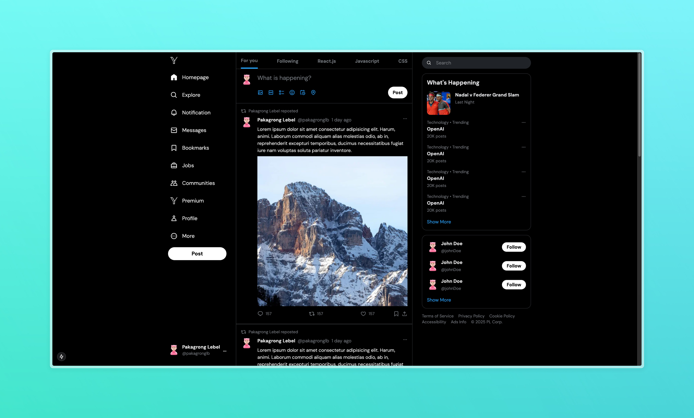

# Y - Social Media Platform



[](https://nextjs.org/)
[](https://www.typescriptlang.org/)
[](https://tailwindcss.com/)
[](https://imagekit.io/)

A modern social media platform built with Next.js 15, inspired by Twitter/X. This project showcases advanced Next.js features and responsive design principles.

## 🎥 Tutorial Credit

This project was built following the excellent tutorial by [Lama Dev](https://www.youtube.com/@LamaDev):
- [Next.js 15 X/Twitter Social Media App UI Design Tutorial](https://www.youtube.com/watch?v=lhqfXt8J8os)

## 🚀 Features

- **Responsive Layout System**
  - Custom Tailwind breakpoints
  - Mobile-first design approach
  - Fluid transitions between screen sizes

- **Advanced Component Architecture**
  - Left Sidebar Navigation
  - Feed Component with infinite scroll
  - Right Sidebar with trending topics
  - Modal-based post creation

- **Media Handling**
  - Image optimization with ImageKit
  - Video upload support
  - Sensitive content handling
  - Server-side image processing

- **Modern UI Features**
  - Custom color schemes
  - Dark mode support
  - Interactive animations
  - Responsive typography

## 🛠️ Technical Implementation

### Installation & Setup

```bash
npm create next-app@latest
npm install @types/node @types/react @types/react-dom typescript
npm install -D tailwindcss postcss autoprefixer
```

### Key Components

1. **Layout System**
   - Custom responsive breakpoints
   - Nested layout components
   - Parallel routing implementation

2. **Feed Component**
   - Post rendering optimization
   - Infinite scroll implementation
   - Interactive engagement features

3. **Media Management**
   - ImageKit integration
   - Client-side image preview
   - Server-side image processing
   - Video upload handling

4. **User Interface**
   - Custom Tailwind configuration
   - Responsive design patterns
   - Modal implementations
   - Form handling

## 📱 Responsive Design

The application implements a comprehensive responsive design system:

- **Mobile**: < 640px
- **Tablet**: 640px - 1024px
- **Desktop**: > 1024px
- **Large Desktop**: > 1280px

## 🎨 Custom Styling

```typescript
// tailwind.config.js
module.exports = {
theme: {
extend: {
colors: {
primary: "#1DA1F2",
// ... other custom colors
},
screens: {
// Custom breakpoints
}
}
}
```

## 🔧 Installation & Environment Setup

1. Clone the repository:
```bash
git clone https://github.com/pakagronglb/x-twitter-clone.git
```

2. Install dependencies:
```bash
cd x-twitter-clone
npm install
```

3. Set up environment variables:

Create a `.env.local` file with the following variables:
```bash
# ImageKit Configuration
NEXT_PUBLIC_IMAGEKIT_URL_ENDPOINT="your_imagekit_url_endpoint"
NEXT_PUBLIC_IMAGEKIT_PUBLIC_KEY="your_imagekit_public_key"
IMAGEKIT_PRIVATE_KEY="your_imagekit_private_key"

# Other Configuration
# Add any other environment variables your app needs
```

4. Configure Vercel Environment Variables:
   - Go to your Vercel project
   - Navigate to Settings > Environment Variables
   - Add the following variables:
     - `NEXT_PUBLIC_IMAGEKIT_URL_ENDPOINT`
     - `NEXT_PUBLIC_IMAGEKIT_PUBLIC_KEY`
     - `IMAGEKIT_PRIVATE_KEY`

5. Run the development server:
```bash
npm run dev
```

## 🚀 Deployment

### Deploying to Vercel

1. Push your code to GitHub
2. Import your repository in Vercel
3. Ensure all environment variables are set in Vercel project settings
4. Deploy!

If you encounter deployment issues:
- Verify all environment variables are set correctly
- Check build logs for specific errors
- Ensure ImageKit configuration is complete

## 🤝 Contributing

Contributions are welcome! Please feel free to submit a Pull Request.

## 📄 License

This project is licensed under the MIT License - see the [LICENSE](LICENSE) file for details.

## 🙏 Acknowledgments

- [Lama Dev](https://www.youtube.com/@LamaDev) for the excellent tutorial
- Next.js team for the amazing framework
- The open-source community

---
Built with ❤️ using Next.js 15


